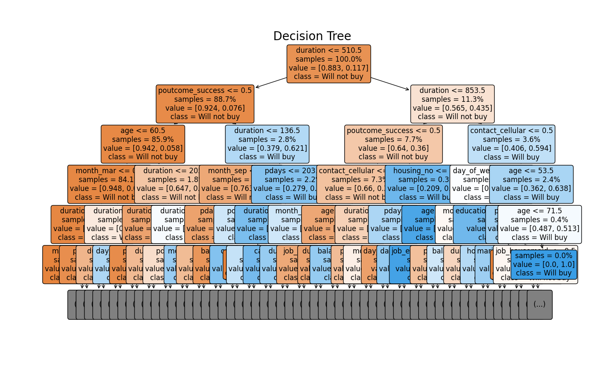

# Customer Purchase Prediction using Decision Tree Classifier

This project demonstrates how to use a Decision Tree Classifier to predict whether a customer will purchase a product or service based on their demographic and behavioral data. The dataset used is the Bank Marketing dataset from the UCI Machine Learning Repository.

## Table of Contents

- [Overview](#overview)
- [Installation](#installation)
- [Usage](#usage)
- [Project Structure](#project-structure)
- [Results](#results)
- [License](#license)

## Overview

The project uses a Decision Tree Classifier to predict customer behavior. The model is trained on the Bank Marketing dataset, which contains various features such as age, job, marital status, and more. The primary goal is to predict whether a customer will subscribe to a term deposit (Yes/No).

## Installation

To get started with this project, you'll need to install the required Python libraries. The dataset is fetched using the `ucimlrepo` package. Follow the steps below:

1. **Clone the repository:**

   ```bash
   git clone https://github.com/Slayerma/PRODIGY_DS_03.git
   cd PRODIGY_DS_03
   ```

2. **Create a virtual environment (optional but recommended):**

   ```bash
   python3 -m venv venv
   source venv/bin/activate  # On Windows use `venv\Scripts\activate`
   ```

3. **Install the dependencies:**

   ```bash
   pip install -r requirements.txt
   ```

   If you don't have `ucimlrepo` installed, you can install it via pip:

   ```bash
   pip install ucimlrepo
   ```

## Usage

Once you have installed the dependencies, you can run the main script to train the model, evaluate it, and visualize the decision tree.

```bash
python task_3.py
```

### Example Output

- **Classification Report**: A detailed performance report showing precision, recall, F1-score, and accuracy.
- **Decision Tree Visualization**: A visual representation of the decision tree used for classification.
- **Customer Predictions**: The number of customers predicted to purchase the product.

## Project Structure

```plaintext
customer-purchase-prediction/
│
├── task_3.py              # Main script to run the project
├── requirements.txt     # List of required Python packages
└── README.md            # Project documentation
```

## Results

- The model's performance is evaluated using a classification report and accuracy score.
- A visual representation of the decision tree is provided to better understand the decision-making process.
- The number of customers predicted to buy or not buy the product is displayed.

### Decision Tree Visualization

Below is the visualization of the decision tree used in the project:




